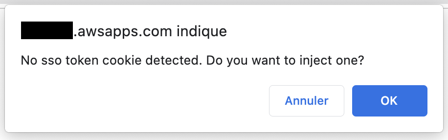
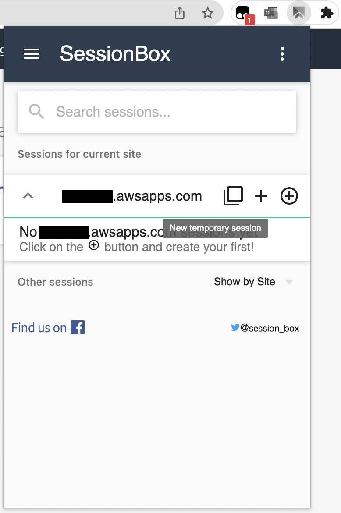
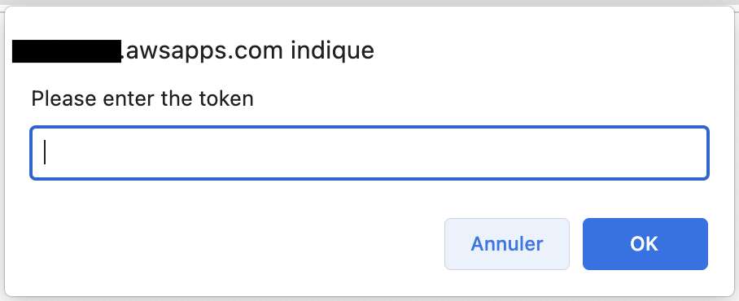

# aws-sso-tampermonkey-scripts

## AWS SSO Retrieve and inject session token

`retrieve_and_inject_session_token.user.js`

This script enable :
 - to export current SSO token from the AWS SSO portal page
 - import the SSO token into another session

The scripts depend on :
 - the official JQuery 3.6.1 minified slim version
 - a custom Gist that provides waitForKeyElements function

### Install

Requires Tampermonkey or Greasemonkey (untested) extension in Chrome or Firefox (untested).

Navigate to this Github repo [retrieve_and_inject_session_token.user.js file](retrieve_and_inject_session_token.user.js), then click on 'Raw' button.
A custom Tampermonkey/Greasemonkey page asked you to 'Install' this userscript. Processed with Install.

### How to use

#### Main session

> Hypothesis: your are not currently logged-in

Open your AWS IAM Identity Center (former AWS SSO) portal link, i.e. https://xyz.awsapps.com/start#/ as usual

You are requested if you want to inject a token. Click "Cancel" and Log-in as usual.

A new Link appears "Copy SSO Token" on top right.

#### Additional Session 

With SessionBox Chrome extension installed : [SessionBox in PlayStore](https://chrome.google.com/webstore/detail/sessionbox-multi-login-to/megbklhjamjbcafknkgmokldgolkdfig)

Click on SessionBox extension icon, then click on the 'Plus' icon (i.e. Temporary session).

If necessary, type the sso portal url. 

You are prompted for injection of token, type Yes. And Paste the token from the main session.

You are now connected on multiple browser sessions, Enjoy ;)

